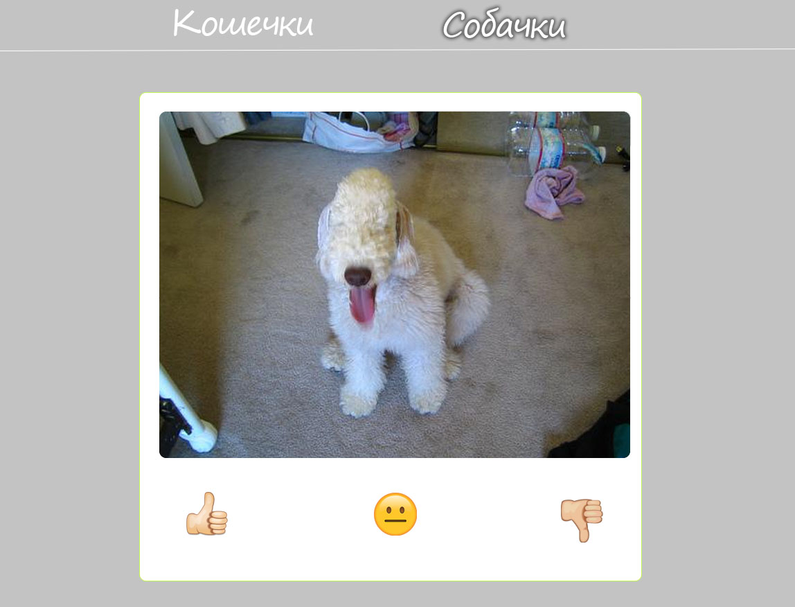

# Кошечки-собачки
### Постарайся успеть всё сделать до 16:00!

# Self-asssesssment: React / Redux

Делаем форк -> после выполнения **каждого релиза** делаем коммит -> делаем Pull Request.

## Цели и задачи
Тебе предстоит сделать приложение для прокрастинации. В нем будет две (или три?) страницы с кошечками и с собачками. На страничке с кошечками отображаются рандомные картинки с кошечками, а на страничке с собачками - сам догадайся кто. Под каждой картинкой есть три кнопки: 👍😐👎  
Таким образом, нажав на 👍 можно добавить картинку **в избранное**. Или в **черный список**, если кликнуть на 👎. После нажатия на любую кнопку показывается другая картинка. Средняя кнопка просто показывает следующую картинку, никак не выражая твоего отношения к текущей.

## Release 0. Init. Eslint

Склонируй репозиторий, проинициализируй проект, установи зависимости, убедись, что работает eslint.  

Прежде чем писать код, прочитай все задание чтобы понять структуру приложения.

## Release 1. Components

Сделай странички `Cat` и `Dog` на реакте, которые будут содержать:
- Компонент `Picture`, внутри которого содержится картинка с кошечкой или собачкой. 
- Компонент `Buttons` который должен содержать кнопки 👍😐👎 и располагаться строго под картинкой.

## Release 2. Cat
Сделай так, чтобы компонент  `Cat` показывал случайную картинку с котом, полученную по API: https://api.thecatapi.com/v1/images/search?size=full 
Ширина отображаемой картинки должна быть не более `640` пикселей, а высота - не более `480`.  

Сделать это нужно с использованием **Redux Thunk**.   

*Если по каким-то причинам этот API не работает (например, возвращает ошибку 500 или 404), то можно получать и отображать любую информацию из любого открытого API, например, из этого списка: https://github.com/public-apis/public-apis*

## Release 3. Dog
Сделай так, чтобы компонент  `Dog` показывал случайную картинку с собакой, полученную по API: https://dog.ceo/api/breeds/image/random
Ширина отображаемой картинки должна быть не более `800` пикселей, а высота - не более `600`.

Сделать это нужно с использованием **Redux Saga**.

## Release 4. React Router
Добавь в шапку сайта навигационное меню и сделай возможность перехода между страницами. 

## Release 5*. Котопёс

*Это опциональный релиз*.

Компоненты `Cat` и `Dog` очень похожи, можно ли использовать для отображения картинок с кошками и собаками один общий компонент? Попробуй переписать свое приложение так, чтобы не копировать "одинаковые компоненты".

## Release 6. Я не люблю ни кошек, ни собак, ни этот ваш редух!!!!11

Сделай еще одну страничку, на которой будет отображаться случайная лиса [отсюда](https://randomfox.ca/floof/) или случайный кролик [отсюда](https://api.bunnies.io/v2/loop/random/?media=webm,mp4).   
Редакс в этом релизе использовать не нужно.

## Release 7. Нажми на кнопку - получишь результат

Размести компонент `Buttons` с кнопками 👍😐👎 под картинками на всех страницах, сделай так, чтобы по нажатию на любую кнопку просто показывалась новая картинка из этого API.

## Release 8. Лайк, репост, подписка на канал

Сделай так, чтобы по нажатию на кнопку 👍картинка добавлялась в избранное. Для этого тебе понадобится бэк на express с базой данных. Тебе понадобится всего одна модель, в которой будет 2 поля: **imageURL** и **comment**. Чтобы иметь возможность добавить коммент, создай компонент  `TypeHere` с текстовым полем `input` и кнопкой "Добавить в избранное", который будет появляться по нажатию на кнопку 👍. После того как юзер нажал на  "Добавить в избранное" и картинка улетела на бэк, на странице должна отобразиться новая картинка.

## Release 9. Любимые картинки

Сделай страничку "Избранное" на которой будет отображаться рандомная картинка из списка любимых картинок. Под ней не должно быть кнопок, как у обычных картинок с API, а должна быть только одна кнопка "Следующая картинка", которая показывает следующую картинку и комментарий который был оставлен при добавлении.   
Удалить картинку из избранного невозможно :)

## Release 10. Дизлайк и атписка

При нажатии на 👎картинка, под которой это было нажато должна добавляться в "черный список". Теперь при получении картинки с любого API, прежде чем показать ее на странице ты должен проверить, нет ли этой картинке в списке запрещенных. Для хранения черного списка используй любое локальное хранилище, например [LocalStorage](https://developer.mozilla.org/ru/docs/Web/API/Window/localStorage).

## Release 11*. Оптимизируй это!
*Это опциональный релиз*.
Всё ли работает оптимально? Если картинок станет много, сайт не будет тормозить? Вспомни такие хуки, как `useMemo` и `useCallback` и воспользуйся хотя бы одним из них. 

**Великолепно!**

